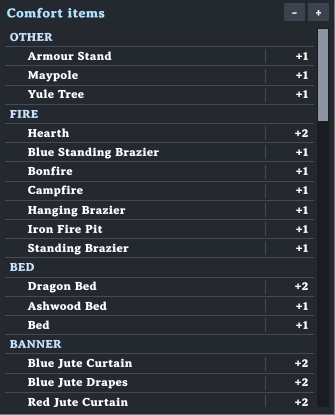
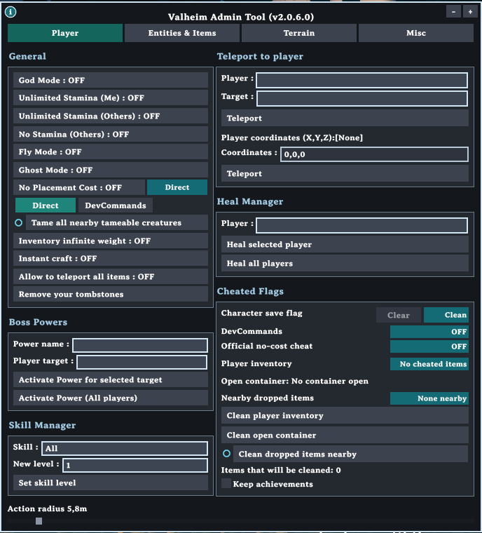
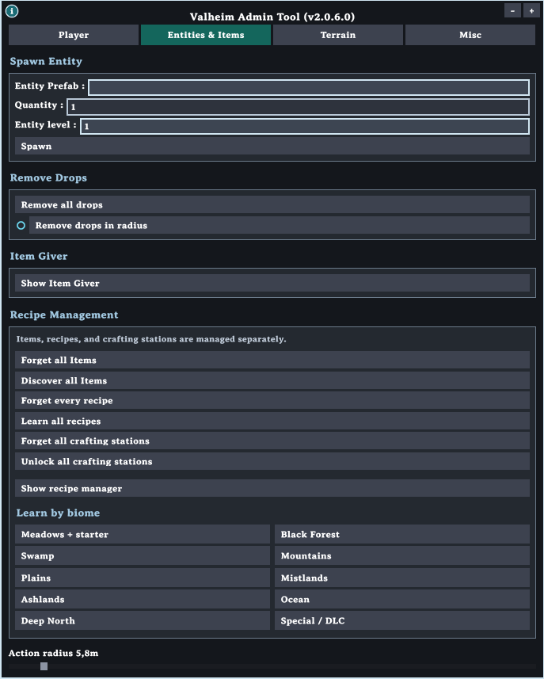
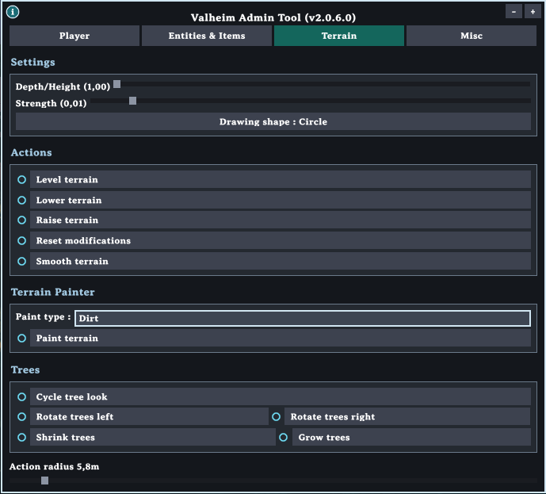
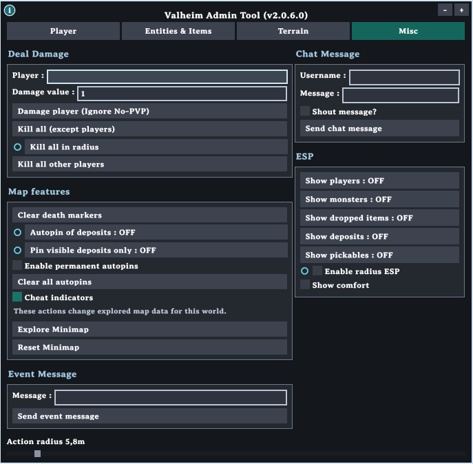

# Valheim Tooler

A BepInEx window for running a Valheim world from inside the game. Version 2.0.6.0 works with Valheim 1.0.15, the current game release.

## Hotkeys

**Delete** shows or hides the window. The window can also start open, depending on your settings file.

**End** only works while the window is on screen. It leaves the window visible and gives mouse control back to the game, so you can walk, fight, and use menus without the tool taking the click. Press End again to make the window clickable. If you hide the window with Delete, End does nothing until you show the window again. Hiding the window does not change whether End is on or off.

**Home** shows or hides a comfort reference table.

The table lists every comfort item in the game and how much comfort it gives, using the current Valheim 1.0 groups: only the highest item in a category counts, and items with no category stack with each other. Category names are in capitals, comfort numbers sit on the right, and light lines separate the rows. Rows you already have nearby are highlighted in dark text, so an empty category is one you are missing. The table ignores clicks while the tool is hidden. While it is hidden, Page Up and Page Down scroll the list. While the tool is open you can drag the table by its title bar, and **+** and **−** in the table's top-right change its size.

**+** and **−** in the top-right of the window make the whole tool larger or smaller. The size is remembered.

The **i** button in the top-left explains how actions run. Options without a tag use **Direct**: game calls that do not mark items or builds as cheated. A **Direct** or **DevCommands** tag means that option can use either method. **DevCommands** uses the game's own cheat flags, so items or builds can be tagged.

## Action radius

One slider at the bottom of the window sets the distance for every option marked with a circle. That covers tame, dropped items, kill, autopin, ESP, terrain, and trees. Hover a circled option to see the dashed range on the ground, including on stone floors.

## Player

* God mode, fly, ghost, unlimited stamina for you, and stamina controls for other nearby players.
* No placement cost, instant craft, and unlimited carry weight.
* Teleport a player to another player, a map pin, or typed coordinates. A toggle allows teleporting while carrying items that normally block portals.
* Heal one player or everyone nearby.
* Give a boss power to one player or to everyone.
* Set any skill to a chosen level.
* Tame tameable creatures inside the action radius.
* Remove your own tombstones.
* Cheated-flag panel: see whether the character save is tagged, whether devcommands or the official no-cost cheat is on, and whether your inventory, an open chest, or nearby drops contain cheated items. Clear those tags, or keep achievements on with the bypass toggle.
* Reveal the whole minimap, or wipe explored map data. Both ask you to confirm because they are hard to undo.

## Entities and items

* Spawn a prefab in front of you. The list starts empty so a click does not spawn the first creature. Set quantity and level, then press Spawn.
* Remove every dropped item, or only the ones inside the action radius.
* Item Giver opens a separate window. Pick a category, quality, and amount, then add the item. You can also set who the item was crafted by.
* Recipe Management treats discovered items, known recipes, and crafting stations as three separate lists. You can forget or restore each one. Learn by biome also discovers that biome's items and materials.
* The recipe manager window has Unlocked, Locked, and Recent tabs. Click a biome there to select that biome's entries in the current tab, and click it again to clear the selection. Forget or learn the selection from the buttons under the grid.

## Terrain

* Level, raise, lower, smooth, reset, or paint ground inside the action radius. Depth and strength have their own sliders. The brush can be a circle or a square.
* Cycle tree look swaps a tree for another look of the same kind. Rotate turns trees 10 degrees left or right. Shrink and Grow change their size a step at a time. All of these use the action radius.

## Misc

* Deal damage to one player, ignoring the no-PVP flag. Kill creatures in the action radius, kill every creature, or kill every other player.
* Clear death pins. Autopin marks ore deposits inside the action radius. **Pin visible deposits only** is a second switch: while Autopin is on, buried silver and scrap iron covered by trees are skipped.
* Red, orange, and yellow dots show cheated items. Red means your inventory. It sits above the minimap, and moves above the inventory while that is open. Yellow means the open container has a cheated item. Orange means a cheated drop is nearby.
* Show comfort draws a colored ring for each piece that is actually adding to your comfort, at your height, with the same color on the name. The ring is the game's 10 meter comfort edge.
* ESP can mark players, creatures, drops, deposits, and pickables. Limit it to the action radius if you want.
* Send a center-screen event message to every player on the server.
* Send a chat line, optionally as a shout, under a chosen name.

## Install

Install [BepInEx for Valheim](https://valheim.thunderstore.io/package/denikson/BepInExPack_Valheim/) first. Copy `ValheimAdminTool.dll`, `ValheimAdminToolMod.dll`, and `SharpConfig.dll` from [`Built DLLs`](Built%20DLLs) into `BepInEx/plugins/ValheimAdminTool/`, then start the game with mods enabled.

To build it yourself, compile `ValheimAdminTool.sln` as Release | x64 and point the Valheim assembly references at your own game folder.

The first launch writes `BepInEx/config/valheimtooler_settings.cfg`. That file stores the toggle key, language, startup visibility, and shortcuts.

## Credits

* [BepInEx](https://github.com/BepInEx/BepInEx) for the configuration format.

Original [Valheim Tooler](https://github.com/Astropilot/ValheimTooler) by Astropilot.
